# Test Design – ESBot

## 7.1 Black-Box Testing Techniques

We used black-box techniques here, so we only looked at the spec — no source code.
The relevant validation rules for `QuizRequest` are:

- `topic`: 3–100 characters
- `count`: integer, 1–10
- `difficulty`: must be `easy`, `medium`, or `hard`

---

### Step 1 – Equivalence Classes

#### `topic`

| Parameter | Class ID | Type    | Description                        | Test Value         |
|-----------|----------|---------|------------------------------------|--------------------|
| `topic`   | EC-T-1   | Valid   | 3–100 characters                   | `"Python"`         |
| `topic`   | EC-T-2   | Invalid | shorter than 3 chars               | `"ab"`             |
| `topic`   | EC-T-3   | Invalid | longer than 100 chars              | `"a" * 101`        |
| `topic`   | EC-T-4   | Invalid | empty string or null               | `""` / `null`      |

#### `count`

| Parameter | Class ID | Type    | Description                        | Test Value  |
|-----------|----------|---------|------------------------------------|-------------|
| `count`   | EC-C-1   | Valid   | integer between 1 and 10           | `5`         |
| `count`   | EC-C-2   | Invalid | 0 or negative                      | `0`         |
| `count`   | EC-C-3   | Invalid | 11 or more                         | `11`        |
| `count`   | EC-C-4   | Invalid | wrong type (string, float, etc.)   | `"five"`    |
| `count`   | EC-C-5   | Invalid | null / not provided                | `null`      |

#### `difficulty`

| Parameter    | Class ID | Type    | Description                         | Test Value   |
|--------------|----------|---------|-------------------------------------|--------------|
| `difficulty` | EC-D-1   | Valid   | `"easy"`                            | `"easy"`     |
| `difficulty` | EC-D-2   | Valid   | `"medium"`                          | `"medium"`   |
| `difficulty` | EC-D-3   | Valid   | `"hard"`                            | `"hard"`     |
| `difficulty` | EC-D-4   | Invalid | anything else                       | `"extreme"`  |
| `difficulty` | EC-D-5   | Invalid | empty or null                       | `""` / `null`|

---

### Step 2 – Justification + Boundary Value Analysis

**EC-T-1** – `"Python"` is a typical valid topic, nothing special about it, just a normal case. Represents all inputs that are within the allowed length. → FR3

Boundaries for `topic`:

| Position       | Value        | Length | Result   |
|----------------|--------------|--------|----------|
| just below min | `"ab"`       | 2      | rejected |
| minimum        | `"abc"`      | 3      | accepted |
| just above min | `"abcd"`     | 4      | accepted |
| just below max | `"a" * 99`   | 99     | accepted |
| maximum        | `"a" * 100`  | 100    | accepted |
| just above max | `"a" * 101`  | 101    | rejected |

**EC-T-2** – `"ab"` is one char below the minimum. All inputs in this class fail for the same reason, so one value is enough to represent them. → FR3

**EC-T-3** – `"a" * 101` is one char above the upper bound. Also relevant for NFR7 (security) since unbounded string inputs are a known risk.

**EC-T-4** – Empty/null is its own class, not the same as "too short". A missing topic means the whole request can't be processed. → FR3

**EC-C-1** – `5` is a mid-range valid value, no edge case involved. → FR3

Boundaries for `count`:

| Position       | Value | Result   |
|----------------|-------|----------|
| just below min | `0`   | rejected |
| minimum        | `1`   | accepted |
| just above min | `2`   | accepted |
| just below max | `9`   | accepted |
| maximum        | `10`  | accepted |
| just above max | `11`  | rejected |

**EC-C-2** – `0` is the most interesting boundary here — zero questions is semantically pointless. → FR3

**EC-C-3** – `11` is directly over the limit. → FR3

**EC-C-4** – `"five"` as a string where an integer is expected. The type check should happen before any range validation. → FR3, NFR7

**EC-C-5** – A missing count is different from 0 — the field just isn't there. → FR3

**EC-D-1/2/3** – The three accepted values each form their own class since the spec defines them as an explicit enum. All three need to work. → FR3

**EC-D-4** – `"extreme"` is a representative for all undefined difficulty values. Needs to be rejected so the AI doesn't get garbage input. → FR3, NFR7

**EC-D-5** – Same idea as EC-T-4: no value at all is different from a wrong value. → FR3

---

### Step 3 – Decision Table for Answer Evaluation (FR4)

Three conditions affect what happens when a student submits an answer:

| # | Condition | Values |
|---|-----------|--------|
| C1 | answer is empty/blank | yes / no |
| C2 | quiz item exists in session | yes / no |
| C3 | correctness (from AI) | correct / partial / incorrect |

C3 only matters when C1=No and C2=Yes. Otherwise it's a don't-care (–).

| Rule | C1: Empty | C2: Item exists | C3: Correctness | Output                                             | Req.       |
|------|-----------|-----------------|-----------------|----------------------------------------------------|------------|
| R-01 | yes       | yes             | –               | error: answer is empty                             | FR4, NFR7  |
| R-02 | yes       | no              | –               | error: answer is empty                             | FR4, NFR7  |
| R-03 | no        | no              | –               | error: quiz item not found / session expired       | FR4, FR6   |
| R-04 | no        | yes             | correct         | positive feedback                                  | FR4        |
| R-05 | no        | yes             | partial         | partial feedback + explanation                     | FR4        |
| R-06 | no        | yes             | incorrect       | corrective feedback + explanation                  | FR4        |

- R-01 and R-02: empty check comes first regardless of whether the item exists.
- R-03: happens when a session expired while the user was still on the quiz page — realistic edge case.
- R-05: partial correctness is important for open-ended answers, a pure yes/no would lose information there.

---

## 7.2 State Transition Testing — Learning Session Lifecycle

### Step 1 — State Transition Diagram

**Guard conditions:**
- Any interaction event (`submit_message`, `request_quiz`, `submit_answer`, `resume_session`) received in the **EXPIRED** state is **rejected** with a controlled error response. No state change occurs.
- `inactivity_timeout` in the **NEW** state is treated the same as in **ACTIVE** (the session becomes IDLE). Although rare, a session could be created but never used before the inactivity timer fires.
- `resume_session` is only meaningful from **IDLE**. In all other states it is either redundant (session is already ACTIVE / NEW) or rejected (EXPIRED).

---

### Step 2 — State Transition Table

All 4 states × 7 events = 28 combinations. Invalid transitions are marked with **–** as the next state.

| Current State | Event              | Next State | Output / Action                                                              | Req.       |
|---------------|--------------------|------------|------------------------------------------------------------------------------|------------|
| NEW           | submit_message     | ACTIVE     | Message accepted; session context initialised; interaction history started   | FR6, FR1   |
| NEW           | request_quiz       | ACTIVE     | Quiz request accepted; session context initialised                           | FR6, FR3   |
| NEW           | submit_answer      | –          | **Rejected** — return controlled error: "no active quiz in session"          | FR6, NFR3  |
| NEW           | inactivity_timeout | IDLE       | Session marked IDLE; no interaction yet; resumable                           | FR6        |
| NEW           | session_timeout    | EXPIRED    | Session terminated; no further interactions accepted                         | FR6        |
| NEW           | close_session      | EXPIRED    | Session explicitly closed                                                    | FR6        |
| NEW           | resume_session     | NEW        | No-op / ignored — session is already in initial state; no error              | FR6        |
| ACTIVE        | submit_message     | ACTIVE     | Message accepted; conversation history updated                               | FR6, FR1   |
| ACTIVE        | request_quiz       | ACTIVE     | Quiz generated; session context updated                                      | FR6, FR3   |
| ACTIVE        | submit_answer      | ACTIVE     | Answer evaluated; feedback returned; session context updated                 | FR6, FR3   |
| ACTIVE        | inactivity_timeout | IDLE       | Session marked IDLE; state preserved; user can resume later                  | FR6        |
| ACTIVE        | session_timeout    | EXPIRED    | Session terminated; stored for reference only; no new interactions           | FR6        |
| ACTIVE        | close_session      | EXPIRED    | Session explicitly closed by student or system                               | FR6        |
| ACTIVE        | resume_session     | ACTIVE     | No-op / ignored — session is already active; no error                        | FR6        |
| IDLE          | submit_message     | ACTIVE     | Auto-resume triggered; message accepted; session reactivated                 | FR6, FR5   |
| IDLE          | request_quiz       | ACTIVE     | Auto-resume triggered; quiz request accepted; session reactivated            | FR6, FR5   |
| IDLE          | submit_answer      | ACTIVE     | Auto-resume triggered; answer accepted; session reactivated                  | FR6, FR5   |
| IDLE          | inactivity_timeout | IDLE       | Already IDLE; no change; timer reset                                         | FR6        |
| IDLE          | session_timeout    | EXPIRED    | Maximum session lifetime exceeded; session terminated                        | FR6        |
| IDLE          | close_session      | EXPIRED    | Session explicitly closed while idle                                         | FR6        |
| IDLE          | resume_session     | ACTIVE     | Session explicitly resumed; interaction history accessible again             | FR6, FR5   |
| EXPIRED       | submit_message     | –          | **Rejected** — return controlled error: "session expired, please start new" | FR6, NFR3  |
| EXPIRED       | request_quiz       | –          | **Rejected** — return controlled error: "session expired, please start new" | FR6, NFR3  |
| EXPIRED       | submit_answer      | –          | **Rejected** — return controlled error: "session expired, please start new" | FR6, NFR3  |
| EXPIRED       | inactivity_timeout | EXPIRED    | No-op — session is already terminated; timer ignored                         | FR6        |
| EXPIRED       | session_timeout    | EXPIRED    | No-op — session is already terminated; timer ignored                         | FR6        |
| EXPIRED       | close_session      | EXPIRED    | No-op — session is already closed                                            | FR6        |
| EXPIRED       | resume_session     | –          | **Rejected** — return controlled error: "session expired, cannot resume"    | FR6, NFR3  |

---

### Step 3 — Test Case Derivation (All-Transitions Coverage)

The minimum set below covers every **valid** transition at least once, plus one sequence that deliberately exercises **invalid** transitions to verify controlled error behaviour.

---

#### TS-01 — Happy Path: New → Active → Idle → Active → Expired

Verifies the standard lifecycle including inactivity and explicit close.

| Step | Start State | Event              | Expected Next State | Expected Output / Action                                | Req.      |
|------|-------------|--------------------|---------------------|---------------------------------------------------------|-----------|
| 1    | NEW         | submit_message     | ACTIVE              | Message accepted; session context initialised           | FR6, FR1  |
| 2    | ACTIVE      | request_quiz       | ACTIVE              | Quiz generated; session context updated                 | FR6, FR3  |
| 3    | ACTIVE      | submit_answer      | ACTIVE              | Answer evaluated; feedback returned                     | FR6, FR3  |
| 4    | ACTIVE      | inactivity_timeout | IDLE                | Session marked IDLE; user notified if applicable        | FR6       |
| 5    | IDLE        | resume_session     | ACTIVE              | Session reactivated; history accessible                 | FR6, FR5  |
| 6    | ACTIVE      | submit_message     | ACTIVE              | Message accepted; conversation history updated          | FR6, FR1  |
| 7    | ACTIVE      | close_session      | EXPIRED             | Session explicitly closed                               | FR6       |

---

#### TS-02 — Session Timeout from Active State

Verifies that the session_timeout event terminates an active session.

| Step | Start State | Event           | Expected Next State | Expected Output / Action                                    | Req. |
|------|-------------|-----------------|---------------------|-------------------------------------------------------------|------|
| 1    | NEW         | request_quiz    | ACTIVE              | Quiz request accepted; session initialised                  | FR6  |
| 2    | ACTIVE      | session_timeout | EXPIRED             | Session terminated; lifetime exceeded                       | FR6  |

---

#### TS-03 — Idle → Expired via Session Timeout

Verifies that session_timeout from IDLE state terminates the session correctly.

| Step | Start State | Event              | Expected Next State | Expected Output / Action                             | Req. |
|------|-------------|--------------------|---------------------|------------------------------------------------------|------|
| 1    | NEW         | submit_message     | ACTIVE              | Message accepted; session initialised                | FR6  |
| 2    | ACTIVE      | inactivity_timeout | IDLE                | Session marked IDLE                                  | FR6  |
| 3    | IDLE        | session_timeout    | EXPIRED             | Maximum lifetime exceeded; session terminated        | FR6  |

---

#### TS-04 — Auto-Resume from Idle via Interaction Event

Verifies that submitting a message while IDLE reactivates the session automatically (covers IDLE → ACTIVE via submit_message, request_quiz, submit_answer).

| Step | Start State | Event              | Expected Next State | Expected Output / Action                              | Req.      |
|------|-------------|--------------------|---------------------|-------------------------------------------------------|-----------|
| 1    | NEW         | submit_message     | ACTIVE              | Session initialised                                   | FR6       |
| 2    | ACTIVE      | inactivity_timeout | IDLE                | Session marked IDLE                                   | FR6       |
| 3    | IDLE        | submit_message     | ACTIVE              | Auto-resume; message accepted; history preserved      | FR6, FR5  |
| 4    | ACTIVE      | inactivity_timeout | IDLE                | Session marked IDLE again                             | FR6       |
| 5    | IDLE        | request_quiz       | ACTIVE              | Auto-resume; quiz request accepted                    | FR6, FR5  |
| 6    | ACTIVE      | inactivity_timeout | IDLE                | Session marked IDLE again                             | FR6       |
| 7    | IDLE        | submit_answer      | ACTIVE              | Auto-resume; answer accepted                          | FR6, FR5  |
| 8    | ACTIVE      | close_session      | EXPIRED             | Session closed                                        | FR6       |

---

#### TS-05 — New Session Timeout and Close

Covers NEW → EXPIRED via both timeout and explicit close (two sub-paths).

| Step | Start State | Event           | Expected Next State | Expected Output / Action                              | Req. |
|------|-------------|-----------------|---------------------|-------------------------------------------------------|------|
| 1    | NEW         | session_timeout | EXPIRED             | Session terminated before any interaction             | FR6  |

*(Second sub-path: step 1 with `close_session` event — same expected outcome.)*

---

#### TS-06 — Invalid Transitions on Expired Session (negative test)

Verifies that all interaction events on an EXPIRED session are rejected with a controlled error. This sequence covers the FR6 / NFR3 requirement for graceful degradation.

| Step | Start State | Event           | Expected Next State | Expected Output / Action                                          | Req.      |
|------|-------------|-----------------|---------------------|-------------------------------------------------------------------|-----------|
| 1    | NEW         | submit_message  | ACTIVE              | Session initialised                                               | FR6       |
| 2    | ACTIVE      | close_session   | EXPIRED             | Session closed                                                    | FR6       |
| 3    | EXPIRED     | submit_message  | – (invalid)         | **Controlled error:** "session expired, please start a new one"  | FR6, NFR3 |
| 4    | EXPIRED     | request_quiz    | – (invalid)         | **Controlled error:** "session expired, please start a new one"  | FR6, NFR3 |
| 5    | EXPIRED     | submit_answer   | – (invalid)         | **Controlled error:** "session expired, please start a new one"  | FR6, NFR3 |
| 6    | EXPIRED     | resume_session  | – (invalid)         | **Controlled error:** "session expired, cannot resume"           | FR6, NFR3 |

The system must **not** crash, silently accept the event, or transition to any new state. Returning a structured error response (HTTP 4xx with a meaningful error body) satisfies NFR3 (Reliability) and is consistent with the edge case "session state missing or expired" identified in earlier exercises.

---

### Coverage Summary

| Transition covered                    | Test Sequence |
|---------------------------------------|---------------|
| NEW → ACTIVE (submit_message)         | TS-01, TS-06  |
| NEW → ACTIVE (request_quiz)           | TS-02         |
| NEW → – (submit_answer, invalid)      | TS-06 (variant)        |
| NEW → IDLE (inactivity_timeout)       | TS-05 (implicit; see table row) |
| NEW → EXPIRED (session_timeout)       | TS-05         |
| NEW → EXPIRED (close_session)         | TS-05 variant |
| ACTIVE → ACTIVE (submit_message)      | TS-01         |
| ACTIVE → ACTIVE (request_quiz)        | TS-01         |
| ACTIVE → ACTIVE (submit_answer)       | TS-01         |
| ACTIVE → IDLE (inactivity_timeout)    | TS-01, TS-03  |
| ACTIVE → EXPIRED (session_timeout)    | TS-02         |
| ACTIVE → EXPIRED (close_session)      | TS-01, TS-06  |
| IDLE → ACTIVE (resume_session)        | TS-01         |
| IDLE → ACTIVE (submit_message)        | TS-04         |
| IDLE → ACTIVE (request_quiz)          | TS-04         |
| IDLE → ACTIVE (submit_answer)         | TS-04         |
| IDLE → EXPIRED (session_timeout)      | TS-03         |
| IDLE → EXPIRED (close_session)        | TS-04         |
| EXPIRED → – (submit_message, invalid) | TS-06         |
| EXPIRED → – (request_quiz, invalid)   | TS-06         |
| EXPIRED → – (submit_answer, invalid)  | TS-06         |
| EXPIRED → – (resume_session, invalid) | TS-06         |
