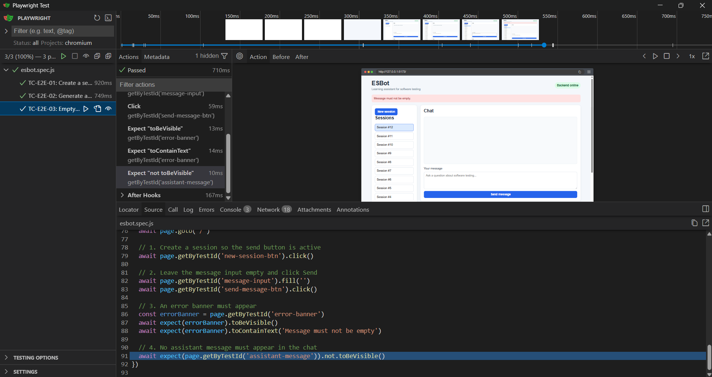

# E2E Test Report

## Test execution summary
Playwright v10.9.2 was used to execute each test suite 3 times.

Following commands were processed:

#### Headless run:
```bash
npm run test:e2e:playwright
```
- **Runs**: 3 runs
- **Passed/Failed (Run 1)**: Passed - Passed - Passed
- **Passed/Failed (Run 2)**: Passed - Passed - Passed
- **Passed/Failed (Run 3)**: Passed - Passed - Passed
- **Total Runtime (per run)**: between 2.4s and 2.9s

#### Interactive (Headed):
```bash
npx playwright test --headed
```
- **Runs**: 3 runs
- **Passed/Failed (Run 1)**: Passed - Passed - Passed
- **Passed/Failed (Run 2)**: Passed - Passed - Passed
- **Passed/Failed (Run 3)**: Passed - Passed - Passed
- **Total Runtime (per run)**: between 4.0s and 5.3s

#### Interactive (UI-Mode):
```bash
npx playwright test --ui
```
- **Runs**: 3 runs
- **Passed/Failed (Run 1)**: Passed - Passed - Passed
- **Passed/Failed (Run 2)**: Passed - Passed - Passed
- **Passed/Failed (Run 3)**: Passed - Passed - Passed
- **Total Runtime (per run)**: between 2.0s and 3.2s

## Headless output
```bash
(esbot-backend) PS C:\Users\aleno\Documents\Git_Repos\esbot\frontend> npm run test:e2e:playwright

> frontend@0.0.0 test:e2e:playwright
> playwright test


Running 3 tests using 1 worker

  ✓  1 [chromium] › playwright\esbot.spec.js:17:1 › TC-E2E-01: Create a session and send a message (596ms)
  ✓  2 [chromium] › playwright\esbot.spec.js:51:1 › TC-E2E-02: Generate a quiz for a topic (466ms)
  ✓  3 [chromium] › playwright\esbot.spec.js:75:1 › TC-E2E-03: Empty message shows an error and does not send (401ms)

  3 passed (3.0s)
```

## Interactive run screenshot


## Flakiness observations
No flaky behavior was observed during test execution.

All E2E tests passed consistently across multiple runs in headless, headed and UI mode (3 runs each).

To reduce the risk of flakiness, the following aspects were ensured:

- The backend used a mock LLM provider, ensuring deterministic responses
- All UI interactions relied exclusively on stable `data-testid` selectors
- No fixed time-based waits (`sleep`) were used; Playwright's auto-waiting mechanisms handled asynchronous UI updates
- Each test run was isolated and did not depend on persisted state from previous runs

Overall, the test suite demonstrated stable and repeatable behavior across all execution modes.

## Reflection

**WHAT WAS EASY?**
Setting up Playwright and writing the tests was straightforward. The frontend already contained all required `data-testid` attributes (`new-session-btn`, `message-input`, `send-message-btn`, `error-banner`, ...), so no changes to `App.jsx` were needed. Playwright's `getByTestId()` API mapped directly to these selectors without any additional configuration. The `StubAIProvider` on the backend ensured fully deterministic responses, which made assertions reliable and simple to write. Playwright's built-in auto-waiting eliminated the need to manually handle React's asynchronous state updates.

**WHAT WAS DIFFICULT OR SURPRISING?**
The main difficulty was ensuring the correct working directory when running the tests: the `npm run test:e2e:playwright` command must be executed from the `frontend/` folder, not the project root, since that is where `package.json` is located. Running it from the project root caused an `ENOENT` error. Another minor challenge was the test isolation for session state: each test creates a new session independently, which works correctly but means the session list grows with every test run against a persistent database. With SQLite this is harmless, but it would need to be addressed in a production-like setup.

In terms of the test pyramid:
- **Unit tests** would catch logic errors in individual frontend or backend components (e.g., validation logic or API handlers).
- **API tests** would detect issues in backend routing, request handling, or data processing before the UI is involved.
- **E2E tests** catch integration issues across the full stack, such as broken UI flows, missing API connections, or incorrect frontend state handling.

If a real (non-mock) LLM were used, the tests would likely become significantly less deterministic. Responses could vary in content and timing, which would increase flakiness risk. In that case, we would need to adjust the assertions to focus even more on structural properties (e.g., response visibility, presence of keywords, or state changes) rather than content-specific expectations.